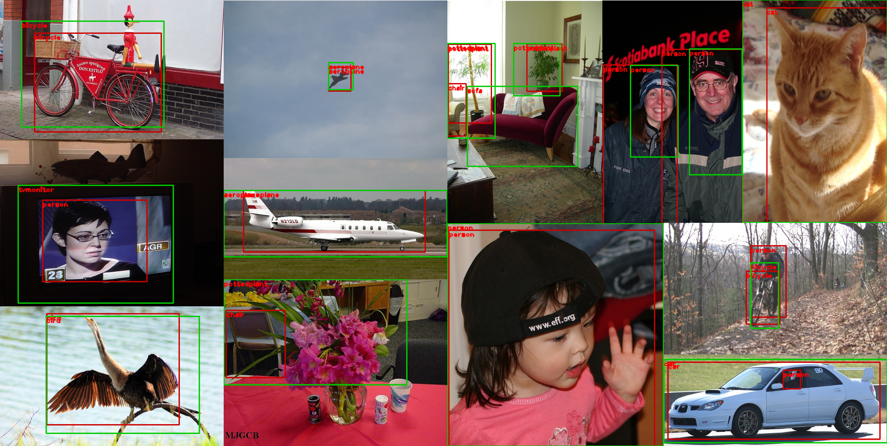

# PyTorch Implementation of Multiple Instance Detection Network with Online Instance Classifier Refinement (OICR)

[paper](https://arxiv.org/abs/1704.00138)

## How to Start

`git clone http://www.github.com/jd730/OICR-pytorch`

### Dependencies

 * Python 3.5 or higher
* Pytorch 0.4.0 (not 0.4.1)
* CUDA 8.0 or higher 

### Data preparation

* **PASCAL_VOC 07+12**: Please follow the instructions in [py-faster-rcnn](https://github.com/rbgirshick/py-faster-rcnn#beyond-the-demo-installation-for-training-and-testing-models) to prepare VOC datasets. Actually, you can refer to any others. After downloading the data, creat softlinks in the folder data/.

### Selective Search
```
wget https://dl.dropboxusercontent.com/s/orrt7o6bp6ae0tc/selective_search_data.tgz
tar -xvf selective_search_data.tgz
rm -rf selective_search_data.tgz
```
move `selective_search_data` folder into `data` folder.

### Pretrained Model

* VGG16: [Dropbox](https://www.dropbox.com/s/s3brpk0bdq60nyb/vgg16_caffe.pth?dl=0), [VT Server](https://filebox.ece.vt.edu/~jw2yang/faster-rcnn/pretrained-base-models/vgg16_caffe.pth)

Download them and put them into the `data/pretrained_model/`.

**NOTE**. We compare the pretrained models from Pytorch and Caffe, and surprisingly find Caffe pretrained models have slightly better performance than Pytorch pretrained. We would suggest to use Caffe pretrained models from the above link to reproduce our results.

**If you want to use pytorch pre-trained models, please remember to transpose images from BGR to RGB, and also use the same data transformer (minus mean and normalize) as used in pretrained model.**

### Compilation

As pointed out by [ruotianluo/pytorch-faster-rcnn](https://github.com/ruotianluo/pytorch-faster-rcnn), choose the right `-arch` in `make.sh` file, to compile the cuda code:

  | GPU model  | Architecture |
  | ------------- | ------------- |
  | TitanX (Maxwell/Pascal) | sm_52 |
  | TitanV or V100 | sm_70 |
  | GTX 960M | sm_50 |
  | GTX 1080 (Ti) | sm_61 |
  | Grid K520 (AWS g2.2xlarge) | sm_30 |
  | Tesla K80 (AWS p2.xlarge) | sm_37 |

More details about setting the architecture can be found [here](https://developer.nvidia.com/cuda-gpus) or [here](http://arnon.dk/matching-sm-architectures-arch-and-gencode-for-various-nvidia-cards/)

1. Install pip dependency
`pip install -r requirement.txt` 

2. Compile th ecuda dependencies
`cd lib & sh make.sh`

## Performance



Green rectangulars are the results of OICR and red rectangulars are ground truth.


## Library description
`trainval_net.py` : main training code.

`test_oicr.py` : test code modified from oicr test code.

`datasets/` : loading pascal_voc

`roi_data_layer/` : loading batch, making roidb and minibatch

`model/` includes network and `roi_align,crop,pooling`.

In `model/oicr*/` there are two files. One is vgg network which assign each layers and the other is oicr class which decides how to make a forward and how network is composed of.

## How to monitor
1. Use tensorboard `--use_tb` flag, but sometime tensorflow session is dead abruptly.
2. Use logger. In this code, the program automatically generate `log.txt` and `progress.csv` in your directory. You can check this using note.ipynb. You can easily understanding through reading the example code in the notebook.

```
file_path = 'jdhwang/1006_seq_tr3/log/progress.csv'
plot_reward_curve_seborn(file_path, mavg=True, mavg_v=1, n=N, target_field='midn_loss', print_header=False,txt_offset=1.0, newfig=False, conv=20)
```


## Run Example
### Training (multi GPU)
`CUDA_VISIBLE_DEVICES=1,2  python3 trainval_net.py --dataset pascal_voc --net vgg16 \
          --bs 4 --nw 4 --save_dir='output' --model='oicr' \
           --lr 0.001 --cuda --disp_interval 50 --mGPUs --vis \
           --checkpoint_interval=500`

### Testing 
`CUDA_VISIBLE_DEVICES=2 python3 test_oicr.py --dataset pascal_voc --net vgg16  --checkpoint 70000  --load_dir='output' --cuda --model='oicr'--vis`

## Notice
`bs` (batch_size) should be divisable by 2. On Caffe, batch is defined as how many forward operations before bacward, and the it does not divide the accumulated loss. To follow this definition and improve the performance, my code automatically forward twice and backward once without divison. See [here](https://github.com/jd730/OICR-pytorch/blob/54921e5c6f88dba7027a7b13b26ffe4adc4aec66/trainval_net.py#L404)


## Reference
https://github.com/ppengtang/oicr

https://github.com/jwyang/faster-rcnn.pytorch
